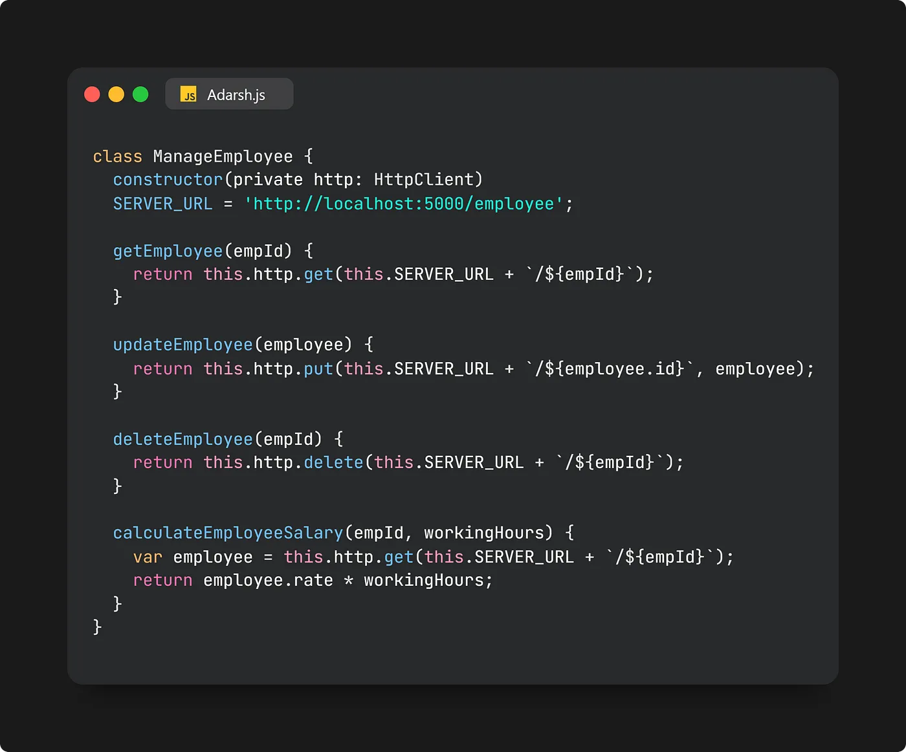
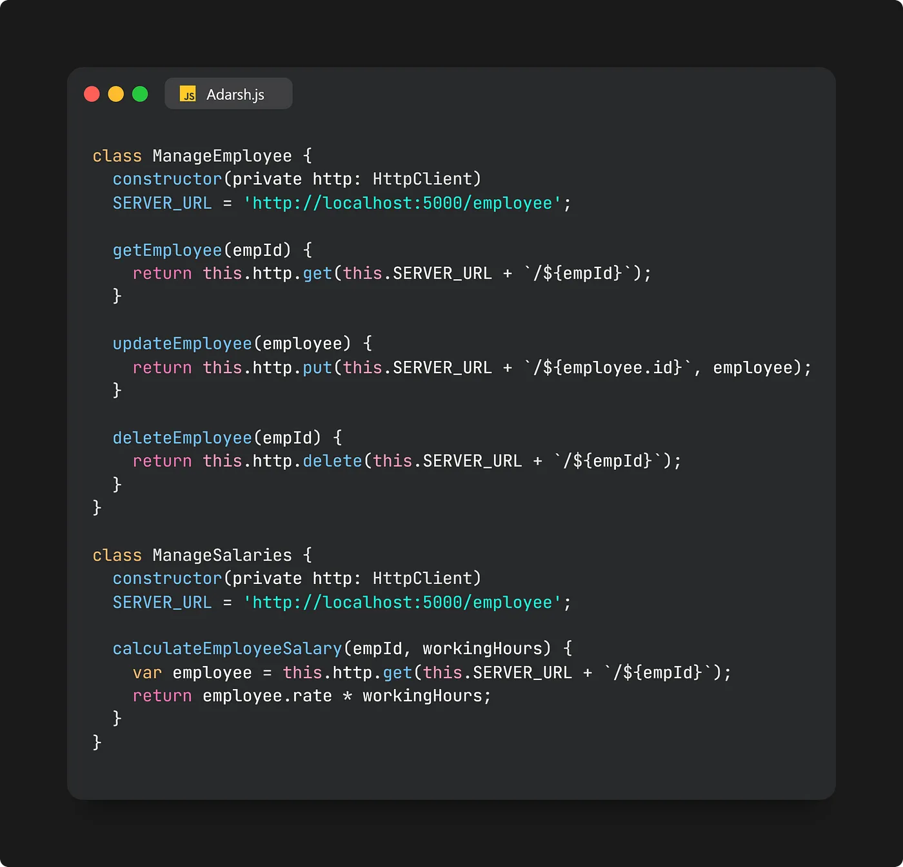

# Single Responsibility Principle

`Note: Aapka class aaisa hone chahiye jisko change ka single reason hona chahiye. In other words Agar future mein kisi class ko change karna h to uska single reason/source hona chahiye`

The Single Responsibility Principle (SRP) suggests that a class, module, or function should serve just one role or responsibility. In simpler terms, it should have a single reason to change.

A class (or module) should have only one reason to change, meaning it should only have one job or responsibility.

## Using Class

Imagine a JavaScript class named ManageEmployee with functions for various employee management tasks:

At first glance, this code might seem alright, but it actually violates the Single Responsibility Principle. The ManageEmployee class handles two different responsibilities: HR management (get, update, delete) and finance management (calculate salary).

If you need to modify a function related to HR or finance in the future, changes in the ManageEmployee class will impact both areas. Therefore, it's essential to separate functionalities concerning HR and finance departments to align with the Single Responsibility Principle.

Here’s an adjusted code example achieving this separation:

## Using Function

// Bad Example: One function with multiple responsibilities.

    const getUserDataAndSave = (user) => {
        fetchUserData(user.id);
        saveToDatabase(user);
    };

// Good Example: Separate functions for fetching and saving user data.

    const fetchUserData = (userId) => {
        // Fetch user data logic
    };

    const saveToDatabase = (user) => {
        // Save user data logic
    };

    // Using the functions with clear responsibilities

    const user = { id: 1, name: "John" };
    const userData = fetchUserData(user.id);
    saveToDatabase(userData);

## Using ReactJs

// Bad Example: One component with multiple responsibilities fetching and showing data.

    function UserProfile() {
        const [userData, setUserData] = useState(null);

        useEffect(() => {
            fetch("https://api.example.com")
            .then((response) => response.json())
            .then((data) => setUserData(data));
        }, []);

        return 
{userData ? <h1>{userData.name}</h1> : 
Loading...
}

    }

// Good Example: Separate component for fetching and displaying user data.

     function UserProfile() {
        const userData = useUserData();

        return 
{userData ? <h1>{userData.name}</h1> : 
Loading...
}

    }

    function useUserData() {
        const [userData, setUserData] = useState(null);

        useEffect(() => {
            fetch("https://api.example.com")
            .then((response) => response.json())
            .then((data) => setUserData(data));
        }, []);

        return userData;
    }

<a href="https://medium.com/@adarshrai3011/mastering-solid-principles-in-javascript-a-comprehensive-guide-3d1ea4755e8a">Reference1</a>
<a href="https://www.youtube.com/watch?v=_wqJYjd9NQw&list=PLXQpH_kZIxTWOcC8wvUHBMLSMQQ8LgcmU">Reference2</a>
