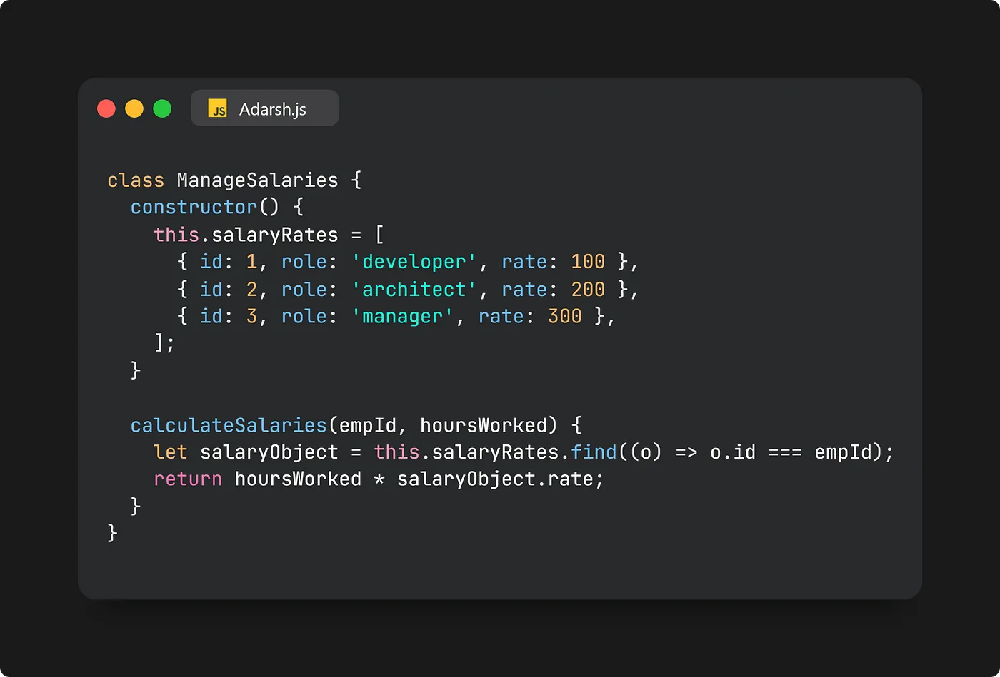
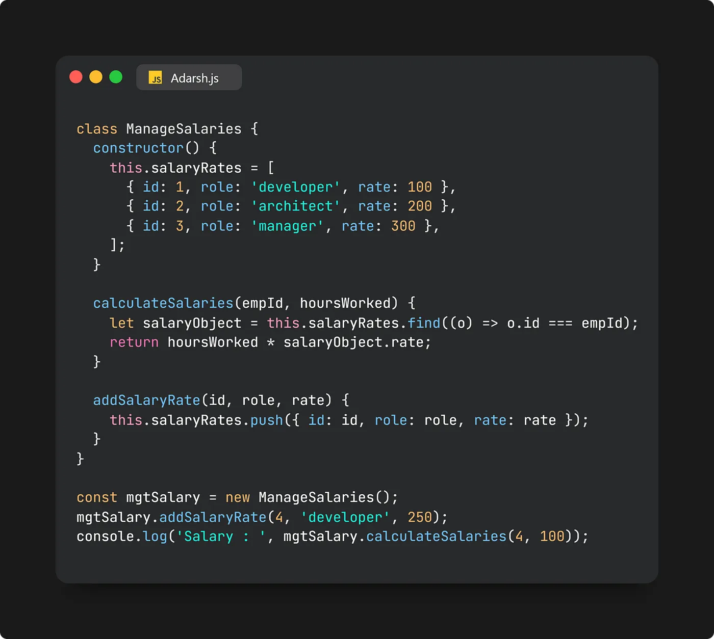

# Open-Closed Principle

The Open-Closed Principle asserts that functions, modules, and classes ought to be extendable without necessitating modifications. This principle holds paramount importance when implementing large-scale applications. It emphasizes the ability to easily introduce new features without altering existing code, preventing disruptive changes.

Software entities should be open for extension but closed for modification. This means you should be able to add new functionality without changing existing code.

## Using Class

For instance, consider a scenario where a function called calculateSalaries() computes salaries based on predefined job roles and hourly rates stored in an array:

Directly altering the salaryRates array contradicts the Open-Closed Principle. For instance, if you need to incorporate a new role into salary calculations, it's crucial to extend the code without modifying the original structure. To align with this principle, a separate method like addSalaryRate() can be introduced to append new salary rates:

By employing addSalaryRate() to include new rates, the existing code remains unchanged, aligning with the Open-Closed Principle. This approach facilitates extending functionality without modifying the original codebase.

// Bad Example: Modification is required to add a new payment method.

    class Payment {
        process(paymentMethod) {
            if (paymentMethod === "credit") {
                console.log("Processing credit payment");
            } else if (paymentMethod === "paypal") {
                console.log("Processing PayPal payment");
            }
        }
    }

// Good Example: Using polymorphism to add payment methods without modifying the Payment class.

    class Payment {
        process(paymentMethod) {
            paymentMethod.pay();
        }
    }

    class CreditPayment {
        pay() {
            console.log("Processing credit payment");
        }
    }

    class PaypalPayment {
        pay() {
            console.log("Processing PayPal payment");
        }
    }

    const payment = new Payment();
    payment.process(new CreditPayment());
    payment.process(new PaypalPayment());

## Using Function

// Bad Example: Modifying a function to handle different payment methods.

    const processPayment = (method, amount) => {
        if (method === "credit") {
            console.log(`Processing credit payment of ${amount}`);
        } else if (method === "paypal") {
            console.log(`Processing PayPal payment of ${amount}`);
        }
    };

// Good Example: Use a higher-order function to inject the payment method.

    const processPayment = (paymentMethod, amount) => {
        paymentMethod(amount);
    };

    const creditPayment = (amount) => console.log(`Processing credit payment of ${amount}`);
    const paypalPayment = (amount) => console.log(`Processing PayPal payment of ${amount}`);

    // Extending without modifying processPayment
    processPayment(creditPayment, 100);
    processPayment(paypalPayment, 200);

## Using ReactJs

// Bad Example: 

    import React from 'react';

    functon OpenClosePrinciple() {

        function Button({ label, type }) {
            return <button className={`btn-${type}`}>{label}</button>
        }

        return (
            <>
                <Button label="Save" type="primary" />
                 <Button label="Delete" type="danger" />
            </>
        )
    }

// Good Example:

    import React from 'react';

    functon OpenClosePrinciple() {

        function Button({ label, type }) {
            return <button className={type}>{label}</button>
        }

        return (
            <>
                <Button label="Save" type="btn-primary" />
                <Button label="Delete" type="btn-danger" />
            </>
        )
    }

<a href="https://medium.com/@adarshrai3011/mastering-solid-principles-in-javascript-a-comprehensive-guide-3d1ea4755e8a">Reference1</a>
<a href="https://www.youtube.com/watch?v=_wqJYjd9NQw&list=PLXQpH_kZIxTWOcC8wvUHBMLSMQQ8LgcmU">Reference2</a>
