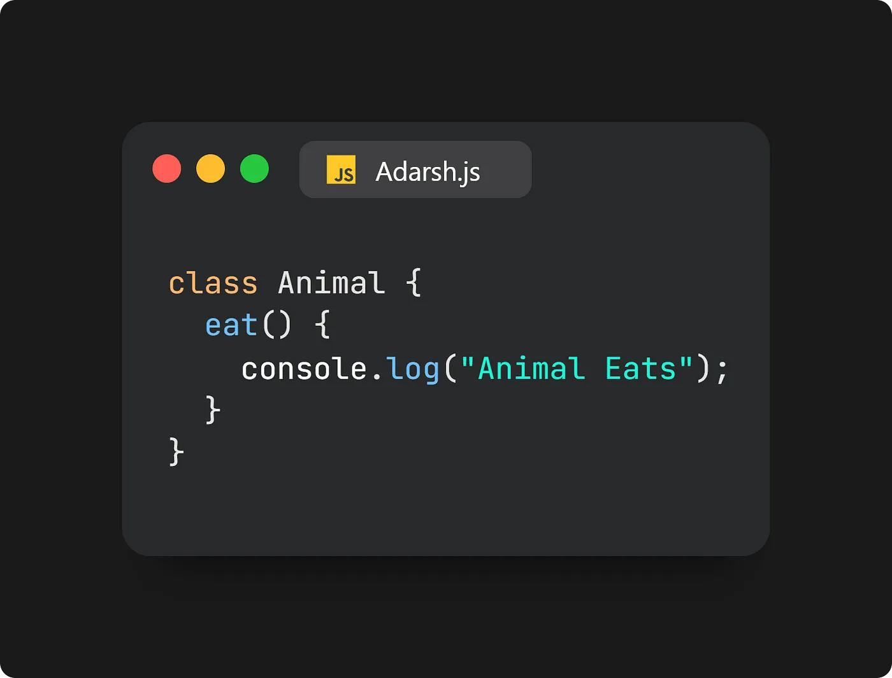

# Liskov Substitution Principle

`Note: Agar aapka parent class ko kahi pe use kar rhe ho or usko aap switch karte ho uske child class se to apka program correctly kaam karna chahiye, koi v alag behavior uske under nhi aana chahiye.`

Subtypes must be substitutable for their base types without altering the correctness of the program. Essentially, derived classes should be able to replace their base classes.

## Using Class

The Liskov principle dictates that substituting a parent class with its subclasses should not cause unexpected behaviors in the application.

For instance, consider an Animal class with an eat() function:

Extending this class to Bird with a fly() function:

In this example, creating an object parrot from the Bird class and calling both eat() and fly() methods does not violate the Liskov principle. The parrot can perform both actions, aligning with expectations.

However, extending Bird further to create an Ostrich class:

This violates the Liskov principle because ostriches cannot fly, potentially causing unexpected behavior. The optimal approach is to extend the Ostrich class from the Animal class instead:

By inheriting from the Animal class rather than Bird, the Ostrich class adheres to the Liskov Substitution Principle, ensuring expected behavior in the application.

## Using Function

// Bad Example: Expecting all items to have a `fly` method, which can throw an error for non-flying types.

    const makeFly = (bird) => bird.fly();

// Good Example: Check behavior or capabilities, not types.

    const canFly = (animal) => typeof animal.fly === 'function';

    const sparrow = { 
        fly: () => console.log("Sparrow is flying!");
    };
    const penguin = { 
        swim: () => console.log("Penguin is swimming!") 
    };

    if (canFly(sparrow)) sparrow.fly();
    if (canFly(penguin)) penguin.fly(); // Safely does nothing

<a href="https://medium.com/@adarshrai3011/mastering-solid-principles-in-javascript-a-comprehensive-guide-3d1ea4755e8a">Reference1</a>
<a href="https://www.youtube.com/watch?v=_wqJYjd9NQw&list=PLXQpH_kZIxTWOcC8wvUHBMLSMQQ8LgcmU">Reference2</a>

