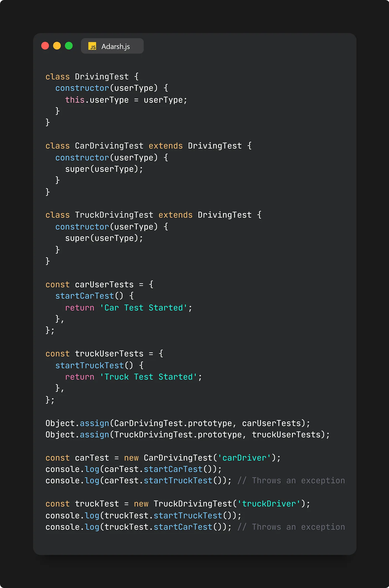

# Interface Segregation Principle

`Note: Aapke code ke under aaisi methods nhi honi chahiye jo use nhi ho rhi ho lekin usko implement karne ki jarurat par rhi hai.`

The Interface Segregation Principle advocates that clients should not be compelled to depend on interfaces they won’t utilize. It emphasizes breaking down extensive interfaces into smaller, more specific ones. To illustrate this, consider attending a driving school where you’re handed comprehensive instructions covering driving cars, trucks, and trains. If you’re there to solely learn car driving, you don’t need the excess information about trucks and trains. Hence, the school should provide instructions tailored to your specific need — driving cars.

For instance, in the given example, there’s a class called DrivingTest containing methods like startCarTest and startTruckTest. Extending this class for CarDrivingTest and TruckDrivingTest forces both classes to implement functions for both cars and trucks.

To align with the Interface Segregation Principle, we can use compositions to attach required functionalities specifically to the relevant classes, as demonstrated in the following code snippet:

This implementation adheres to the Interface Segregation Principle as functionalities are assigned only to the relevant classes, ensuring that unnecessary functionalities aren’t enforced upon them.