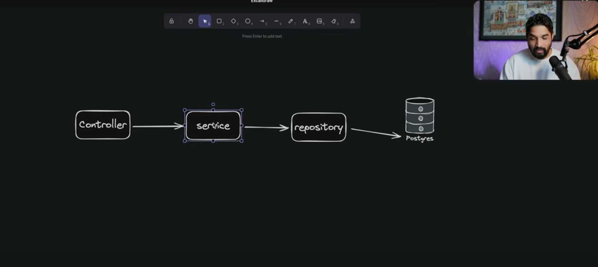
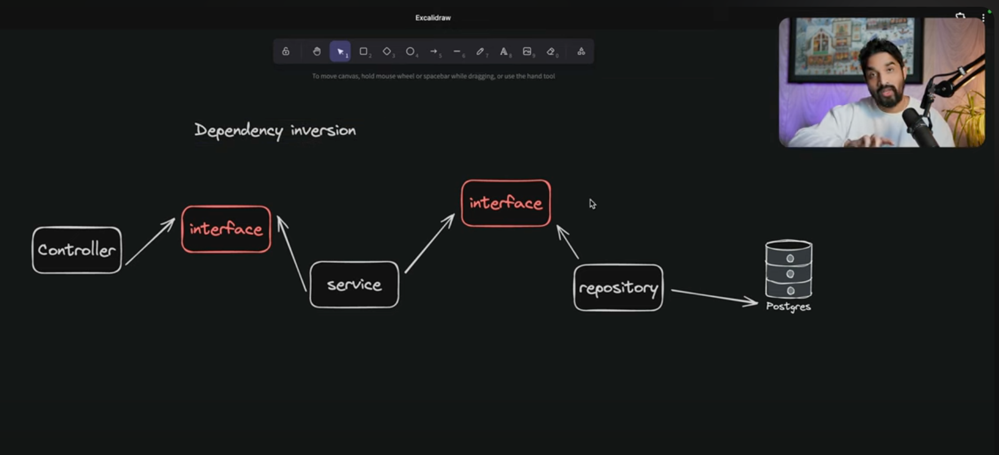
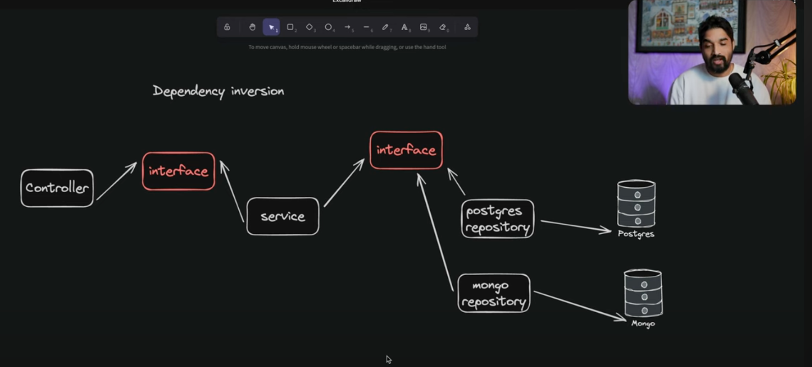

# 5. Dependency Inversion Principle

`Note: Jab bhi hum application bna rhe hote hai, to aapke application ke under jo modules hote hai usko hme loosly couple rakhna hota hai, taki future mein kabhi kuch bhi changes hme karne ho to bahut aasani se uske under change kar sakte hai and ache tarah se testing bhi kar sakte ho.`

The Dependency Inversion Principle (DIP) emphasizes decoupling and abstraction. The principle consists of two core concepts: high-level modules should not depend on low-level modules, and both should depend on abstractions. This inverted dependency relationship promotes flexibility, testability, and maintainability.

## Problem

## Solution

## Benifit

